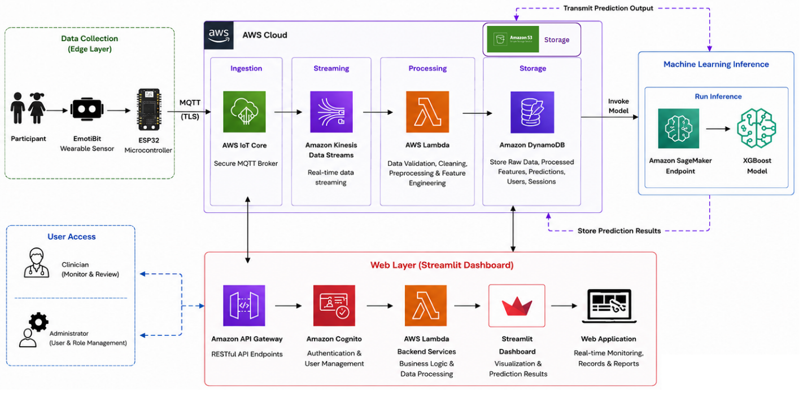
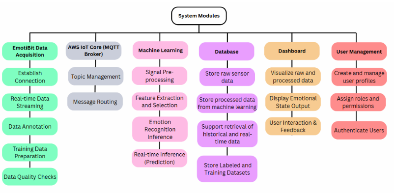
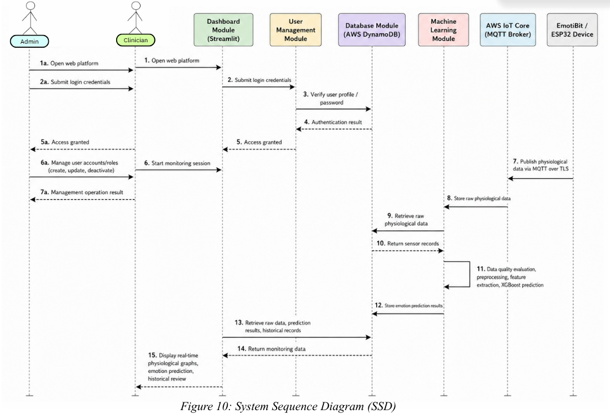

# System Architecture

## Architecture Overview

EmoSI is designed as an end-to-end cloud-based emotion monitoring platform that integrates wearable physiological sensing, cloud computing services, machine learning, and dashboard visualisation. The architecture enables real-time collection, processing, storage, analysis, and presentation of physiological signals acquired from the EmotiBit wearable device.

The system consists of six major modules:

1. EmotiBit Data Acquisition Module
2. AWS IoT Core (MQTT Broker) Module
3. Machine Learning Module
4. Database Module
5. Dashboard Module
6. User Management Module

Together, these modules provide a complete workflow from physiological signal acquisition to emotion prediction and visualisation.

---

## Overall System Architecture

### Architecture Description

The system begins with physiological data collection through the EmotiBit wearable device connected to an ESP32 microcontroller. Sensor readings are transmitted securely to AWS IoT Core using MQTT over TLS.

Incoming data is streamed through Amazon Kinesis and processed using AWS Lambda functions for validation, preprocessing, and feature engineering. Processed features and prediction results are stored in Amazon DynamoDB.

The machine learning inference layer uses an XGBoost model deployed through Amazon SageMaker Endpoint. Prediction results are returned to the database and made available to the dashboard.

The Streamlit-based web application retrieves physiological records and prediction results through backend services and presents them to authorised users for monitoring and analysis.

---

## System Modules

### EmotiBit Data Acquisition Module

The data acquisition module is responsible for collecting physiological and motion-related signals from participants using the EmotiBit wearable device. The module captures PPG, EDA, temperature, accelerometer, gyroscope, and magnetometer readings before transmitting them to the cloud infrastructure.

### AWS IoT Core (MQTT Broker) Module

AWS IoT Core serves as the communication layer between the wearable device and cloud services. The module handles device authentication, MQTT topic management, secure communication, and message routing.

### Machine Learning Module

The machine learning module performs data quality evaluation, preprocessing, feature extraction, model training, and real-time emotion inference. The module utilises an XGBoost model developed using both WESAD and manually labelled EmotiBit datasets.

### Database Module

Amazon DynamoDB functions as the primary database layer for storing physiological sensor data, emotion prediction results, historical records, user profiles, and session information.

### Dashboard Module

The dashboard module provides real-time physiological monitoring, emotion prediction visualisation, historical record retrieval, and data review through a Streamlit web application.

### User Management Module

The user management module controls authentication, role-based access control, account management, and permission assignment for clinicians and administrators.

---

## System Workflow

The overall workflow begins when a participant wears the EmotiBit device and initiates a monitoring session. Physiological signals are continuously collected and transmitted to AWS cloud services through MQTT communication.

Incoming sensor data is processed and stored in DynamoDB. The machine learning module retrieves physiological records, performs feature extraction and emotion inference, and stores prediction results back into the database.

Authorised users access the Streamlit dashboard to review physiological signals, emotion predictions, and historical monitoring records. User authentication and access permissions are managed through the user management module to ensure secure access to system resources.

---

## System Sequence Diagram

### Sequence Description

The sequence diagram illustrates the interactions between users, cloud services, databases, machine learning components, and the dashboard platform during a monitoring session.

The workflow begins with user authentication and dashboard access. Physiological data collected from the EmotiBit device is transmitted to AWS IoT Core and stored in DynamoDB. The machine learning module retrieves the data, performs emotion prediction, and stores the prediction results. The dashboard then retrieves both physiological and emotion records and presents them to authorised users for monitoring and review.
