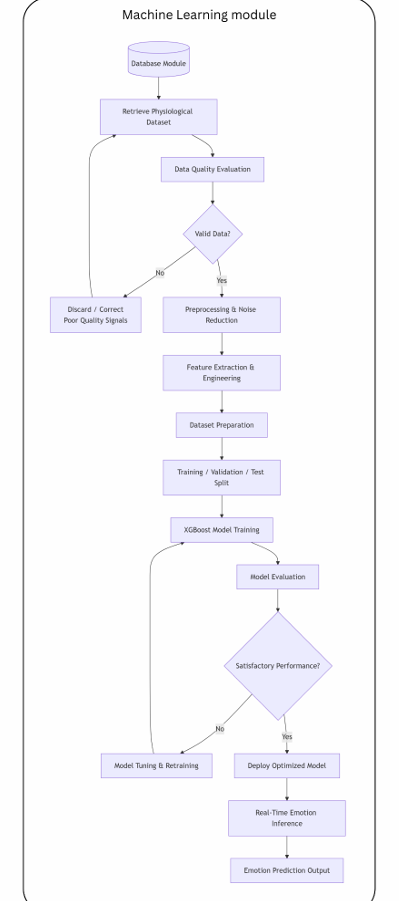

# Machine Learning Pipeline

## Overview

The Machine Learning Pipeline is responsible for transforming physiological sensor measurements into emotion predictions. The pipeline combines physiological signals collected from the EmotiBit wearable device with publicly available physiological datasets to develop a robust emotion recognition model.

The overall objective is to identify emotional states from physiological responses rather than relying on facial expressions, speech, or self-reported questionnaires. This approach enables emotion monitoring in situations where individuals may be unable or unwilling to accurately express their emotions.

The final implementation utilises an XGBoost-based classification model deployed through Amazon SageMaker for real-time emotion inference.

## Machine Learning Workflow

The machine learning workflow consists of the following stages:

1. Data Collection
2. Data Quality Assessment
3. Signal Preprocessing
4. Feature Engineering
5. Dataset Preparation
6. Model Training
7. Model Evaluation
8. Model Deployment
9. Real-Time Inference

Each stage contributes to improving the reliability and accuracy of emotion recognition from physiological data.

## Dataset Sources

A hybrid dataset strategy was adopted to improve model robustness and increase emotion coverage.

### WESAD Dataset

The Wearable Stress and Affect Detection (WESAD) dataset served as the primary benchmark dataset for model development.

WESAD contains physiological recordings collected using wearable sensors under controlled experimental conditions. The dataset provides high-quality physiological measurements and established emotion-related labels that are widely used in affective computing research.

### EmotiBit Dataset

An additional dataset was collected using the EmotiBit wearable device developed as part of this project.

Physiological signals were collected during dedicated recording sessions and manually annotated according to the intended emotional state experienced during data collection activities.

The EmotiBit dataset was used to:

- Validate compatibility with real-world wearable data
- Improve model adaptability to EmotiBit signals
- Expand emotion coverage
- Evaluate deployment feasibility

### Additional Supporting Data

Where necessary, supplementary physiological recordings and publicly available emotion-related datasets were incorporated to improve representation of emotional states that were less prominent in the original WESAD dataset.

## Dataset Harmonisation

One of the major challenges in this project was ensuring compatibility between physiological signals obtained from WESAD and those collected using EmotiBit.

Although the sensing hardware differs, several physiological modalities are directly comparable.

| Physiological Modality | WESAD | EmotiBit |
|------------------------|--------|-----------|
| Blood Volume Pulse | BVP | PPG Infrared / Red / Green |
| Electrodermal Activity | EDA | EDA |
| Skin Temperature | TEMP | TEMP_1 |
| Motion Data | ACC | Accelerometer |

This signal alignment strategy enabled data from multiple sources to be combined into a unified machine learning workflow.

## Physiological Signals Used

The machine learning model utilises physiological signals obtained from the EmotiBit wearable device.

### Cardiovascular Signals

- PPG Infrared
- PPG Red
- PPG Green

These signals are used to estimate cardiovascular activity and derive heart-related features.

### Electrodermal Signals

- EDA
- EDL

These signals represent autonomic nervous system activity and physiological arousal.

### Thermal Signals

- Skin Temperature
- Thermopile Temperature

These measurements capture thermal changes that may be associated with emotional responses.

### Motion Signals

- Accelerometer X, Y, Z
- Gyroscope X, Y, Z
- Magnetometer X, Y, Z

Motion-related signals provide contextual information and assist in identifying movement artefacts.

## Data Preprocessing

Raw physiological signals often contain noise, motion artefacts, and missing values that may negatively impact model performance.

Several preprocessing operations were performed prior to feature extraction:

- Data quality assessment
- Missing value handling
- Signal synchronisation
- Noise reduction
- Data normalisation
- Window segmentation

These preprocessing steps improve signal consistency and prepare the data for feature engineering.

## EDA Signal Decomposition

Electrodermal Activity (EDA) represents changes in skin conductance associated with autonomic nervous system activity.

To provide more meaningful physiological information, EDA signals were decomposed into tonic and phasic components.

### Electrodermal Level (EDL)

The tonic component represents the baseline level of skin conductance over time.

EDL provides information regarding long-term physiological arousal and emotional state.

### Electrodermal Response (EDR)

The phasic component captures short-term fluctuations caused by discrete physiological responses.

EDR is useful for detecting rapid changes in emotional arousal and stress-related reactions.

Separating EDA into tonic and phasic components improves the interpretability of electrodermal features used during model training.

## Feature Engineering

Feature engineering transforms raw physiological signals into informative numerical representations suitable for machine learning.

### Raw Features

Direct sensor measurements include:

- PPG Infrared
- PPG Red
- PPG Green
- EDA
- EDL
- Skin Temperature
- Thermopile Temperature
- Accelerometer
- Gyroscope
- Magnetometer

### Derived Features

Additional features were generated from physiological signals, including:

- Heart Rate (HR)
- Heart Rate Variability (HRV)
- RMSSD
- SDNN
- Activity Level
- Motion Magnitude
- Stress Indicators
- Temperature Trends

These derived features provide richer physiological information than raw sensor values alone.

## Dataset Preparation

After preprocessing and feature extraction, all features were consolidated into a unified dataset.

The dataset was then:

- Cleaned
- Labelled
- Balanced where appropriate
- Split into training, validation, and testing subsets

This process ensured that model evaluation could be performed on unseen data.

## Emotion Label Development

The final emotion recognition model supports five emotion categories:

- Happy
- Neutral
- Nervous
- Sad
- Angry

These emotion classes were developed using a combination of publicly available datasets and project-specific physiological recordings.

WESAD contributed baseline, stress-related, and positive affective physiological patterns, while manually collected EmotiBit recordings and supplementary emotion-related datasets were used to improve representation of additional emotional states.

This hybrid approach enabled the development of a five-class emotion recognition model while maintaining compatibility between training and deployment environments.

## Model Training

XGBoost was selected as the primary machine learning algorithm due to its strong performance on structured physiological datasets.

The training process included:

- Hyperparameter configuration
- Training dataset preparation
- Validation dataset evaluation
- Performance optimisation
- Model selection

XGBoost was chosen because it provides:

- High classification accuracy
- Fast inference performance
- Robust handling of heterogeneous features
- Good scalability for real-time deployment

## Model Evaluation

Model performance was evaluated using multiple classification metrics.

Evaluation metrics included:

- Accuracy
- Precision
- Recall
- F1 Score
- Confusion Matrix

These metrics were used to assess the model's ability to correctly distinguish between emotional states and identify potential classification weaknesses.

The evaluation process helped ensure that the selected model was suitable for deployment within the real-time emotion monitoring platform.

## Model Deployment

After training, the final XGBoost model was exported and prepared for deployment.

Deployment artifacts included:

- xgboost_emotion_model.pkl
- label_encoder.pkl
- model.tar.gz

The deployment package was uploaded to Amazon S3 and subsequently deployed through Amazon SageMaker.

This deployment strategy enables scalable cloud-based emotion inference without requiring local model execution.

## Real-Time Inference Pipeline

The deployed machine learning model supports real-time emotion prediction using physiological data streamed from EmotiBit.

The inference workflow is as follows:

1. Physiological data is collected by EmotiBit.
2. Sensor data is transmitted through ESP32.
3. Data is published to AWS IoT Core.
4. Data is processed through Kinesis and Lambda.
5. Features are prepared for inference.
6. The SageMaker Endpoint is invoked.
7. Emotion probabilities are generated.
8. The dominant emotion is selected.
9. Results are stored in DynamoDB.
10. Predictions are displayed on the Streamlit dashboard.

Each prediction includes confidence scores for all supported emotion classes, while the highest probability emotion is presented as the dominant emotion.

## Limitations and Considerations

Several limitations should be considered when interpreting model predictions.

### Dataset Diversity

The model was trained using a combination of publicly available datasets and project-specific physiological recordings. Additional data from more participants would likely improve generalisation.

### Emotion Complexity

Human emotions are highly complex and may not always correspond to distinct physiological patterns.

### Individual Differences

Physiological responses vary between individuals, meaning the same emotion may produce different physiological signatures across participants.

### Clinical Validation

The model is intended as a research and educational platform rather than a clinically validated diagnostic system.

### Future Improvements

Future work may include:

- Larger participant datasets
- Additional emotion categories
- Deep learning approaches
- Personalised emotion models
- Continuous model retraining pipelines

