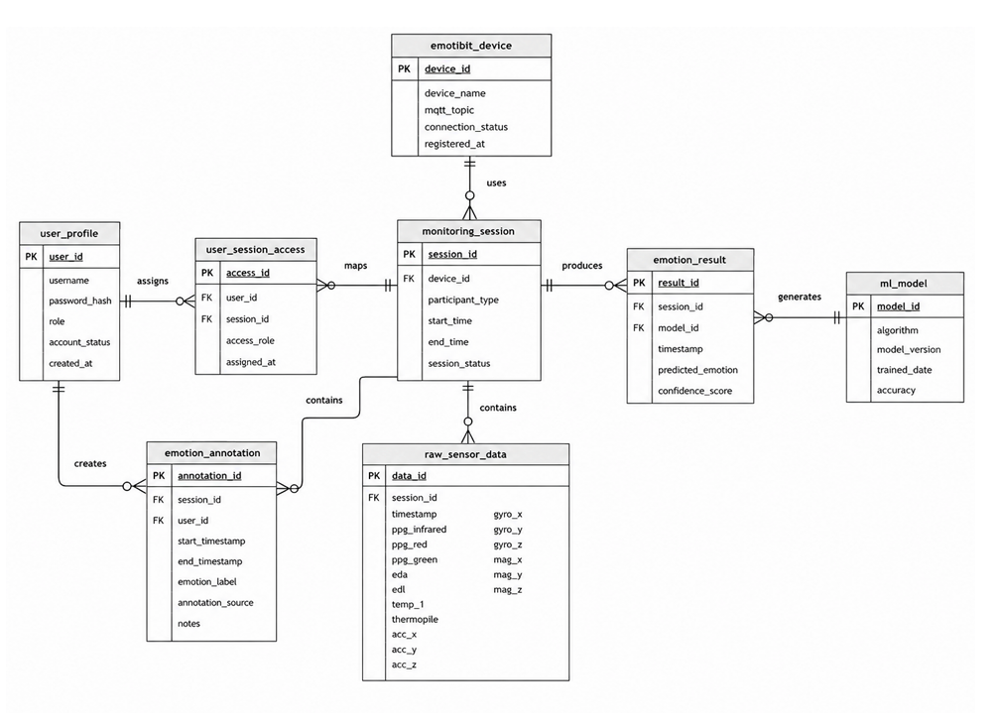
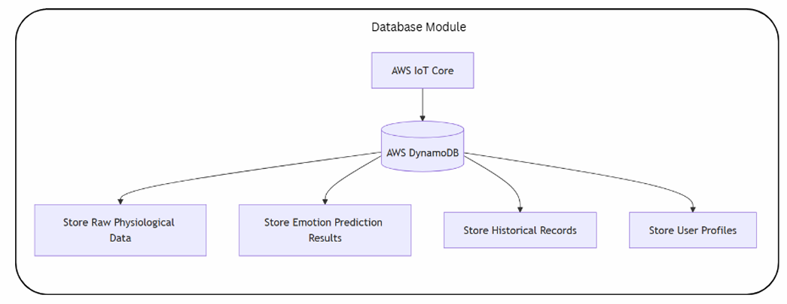

# Database Design

## Overview

The EmoSI platform requires a structured data management system to support physiological monitoring, emotion recognition, user management, and session tracking. The database layer serves as the central repository for storing physiological sensor readings, machine learning predictions, user information, monitoring sessions, and system metadata.

The database design combines a logical entity relationship model with a cloud-based implementation using Amazon DynamoDB. This approach enables scalable storage, low-latency retrieval, and real-time dashboard visualisation.

The database architecture supports the complete workflow from physiological data acquisition through emotion prediction and historical analysis.

## Database Architecture

The database architecture is designed around several core entities that represent users, participants, monitoring sessions, physiological data, machine learning predictions, and device management.

The architecture supports:

- User authentication and management
- Participant profile management
- Monitoring session tracking
- Physiological signal storage
- Emotion annotation and prediction
- Machine learning model management
- Dashboard visualisation

The design follows a modular approach to improve maintainability and future extensibility.

## Entity Relationship Diagram

The Entity Relationship Diagram (ERD) illustrates the logical relationships between major entities within the EmoSI platform.

The design establishes connections between users, participants, monitoring sessions, physiological sensor data, emotion-related records, machine learning models, and wearable devices.

This logical model provides the foundation for both system functionality and database implementation.

## Database Entities

### user_profile

The user_profile entity stores account information for authorised system users.

Key attributes include:

- User ID
- Username
- Password Hash
- Role
- Account Status
- Creation Timestamp

This entity supports authentication, authorisation, and user management functions.

### participant_profile

The participant_profile entity stores information related to monitored participants.

Key attributes include:

- Participant ID
- Name
- Gender
- Date of Birth
- Notes
- Registration Date

This design allows the platform to support multiple participant profiles across different monitoring sessions.

### monitoring_session

The monitoring_session entity records individual monitoring activities.

Key attributes include:

- Session ID
- Participant ID
- Device ID
- Start Time
- End Time
- Session Status

Monitoring sessions provide context for physiological data collection and emotion analysis.

### emotibit_device

The emotibit_device entity stores information about registered wearable devices.

Key attributes include:

- Device ID
- Device Name
- MQTT Topic
- Connection Status
- Registration Date

This entity enables tracking and management of wearable devices connected to the platform.

### raw_sensor_data

The raw_sensor_data entity stores physiological measurements collected from EmotiBit.

Recorded signals include:

- PPG Infrared
- PPG Red
- PPG Green
- EDA
- EDL
- Skin Temperature
- Thermopile Temperature
- Accelerometer
- Gyroscope
- Magnetometer

This entity forms the primary data source for machine learning and dashboard visualisation.

### emotion_annotation

The emotion_annotation entity stores manually assigned emotion labels during data collection activities.

Key attributes include:

- Annotation ID
- Session ID
- User ID
- Emotion Label
- Start Timestamp
- End Timestamp
- Notes

This entity supports supervised machine learning development and dataset creation.

### emotion_prediction

The emotion_prediction entity stores machine learning inference results generated by Amazon SageMaker.

Stored information includes:

- Prediction ID
- Session ID
- Timestamp
- Predicted Emotion
- Confidence Score
- Emotion Probabilities

This entity enables historical review and dashboard visualisation of predicted emotional states.

### ml_model

The ml_model entity stores metadata related to machine learning models.

Key attributes include:

- Model ID
- Algorithm
- Version
- Accuracy
- Training Date
- S3 Storage Location

This entity supports model versioning and deployment management.

### user_session_access

The user_session_access entity manages permissions and access rights.

Key attributes include:

- Access ID
- User ID
- Session ID
- Access Role
- Assignment Date

This entity supports role-based access control throughout the platform.

## DynamoDB Implementation

Although the ERD represents the logical database design, the deployed implementation utilises Amazon DynamoDB as the primary database service.

DynamoDB was selected because it provides:

- Fully managed operation
- Automatic scalability
- Low-latency access
- Serverless architecture
- Seamless integration with AWS services

The platform stores physiological data, emotion predictions, user records, and session information using DynamoDB tables optimised for real-time access patterns.

## Partition Keys and Sort Keys

The primary physiological data table utilises the following key structure:

| Attribute | Purpose |
|------------|------------|
| device_id | Partition Key |
| timestamp | Sort Key |

This design enables efficient retrieval of sensor readings for a specific device while maintaining chronological ordering.

Example:

device_id → emotibit_001

timestamp → 2026-03-18T11:08:24Z

This structure supports:

- Time-series queries
- Historical data retrieval
- Session reconstruction
- Dashboard visualisation

## Data Storage Workflow

The data storage workflow begins when physiological data is received from AWS IoT Core and processed through the cloud infrastructure.

Processed records are stored in DynamoDB, where they become available for:

- Machine learning inference
- Dashboard visualisation
- Historical analysis
- Reporting

Emotion predictions generated by SageMaker are also stored and linked to relevant monitoring sessions.

## Query Patterns

Several common query patterns are supported by the platform.

### Recent Sensor Data

Retrieve the most recent physiological records for a specific device.

### Historical Monitoring Sessions

Retrieve all records associated with a monitoring session.

### Emotion Prediction History

Retrieve historical emotion predictions for a participant.

### Dashboard Analytics

Aggregate physiological and emotion-related data for visualisation purposes.

These query patterns influenced the database design and key selection strategy.

## Future Enhancements

Future database improvements may include:

- Global Secondary Indexes (GSI)
- Automated data archival
- Multi-region replication
- Long-term analytics storage
- Data lifecycle management
- Enhanced audit logging

These enhancements would improve scalability and operational capabilities for larger deployments.

## Limitations and Considerations

Several considerations should be noted regarding the current database implementation.

### NoSQL Design Trade-Offs

DynamoDB prioritises scalability and performance but may require denormalisation compared to traditional relational databases.

### Data Growth

Continuous physiological monitoring generates large volumes of time-series data that may increase storage requirements over time.

### Historical Analytics

Complex analytical queries may require integration with specialised analytics platforms in future deployments.

### Security

Appropriate IAM policies, encryption mechanisms, and access controls should be maintained to protect sensitive physiological data.

