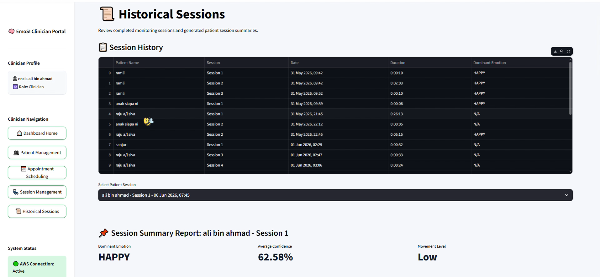
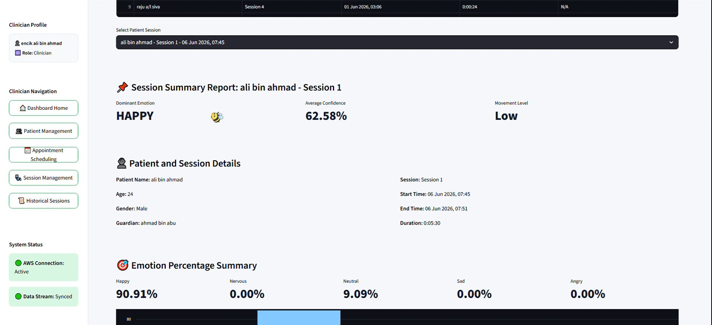
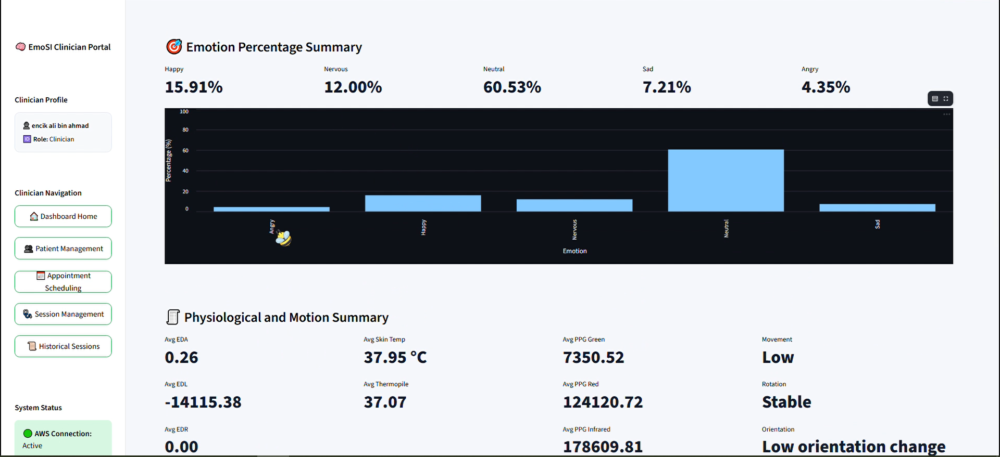
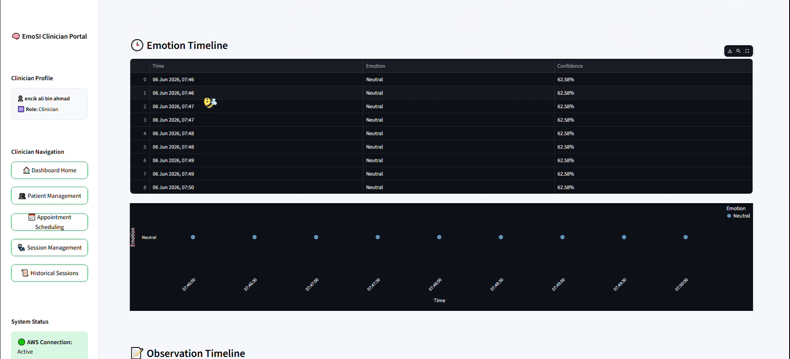
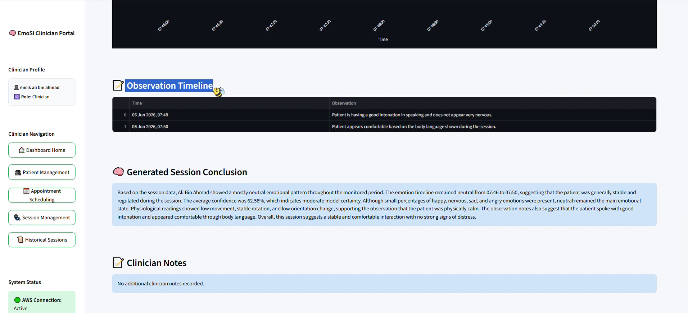
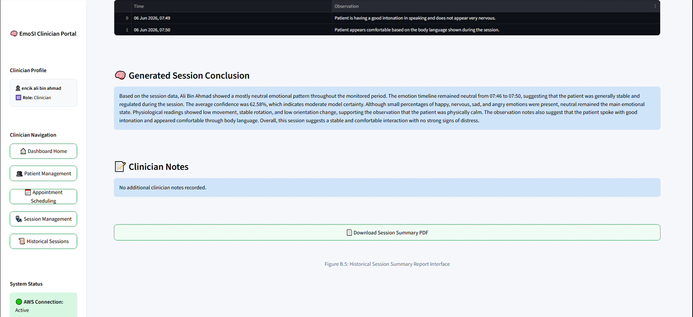
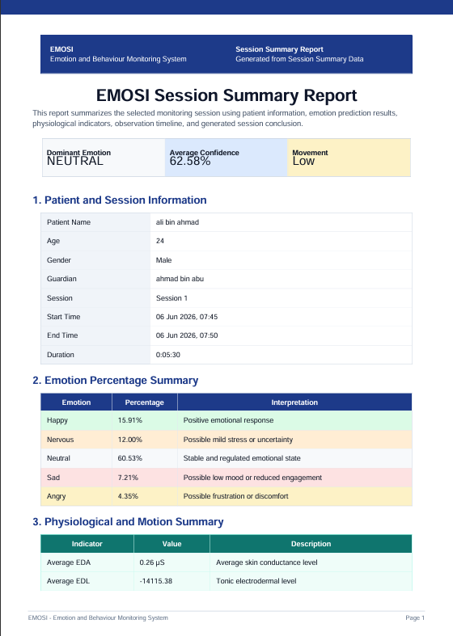
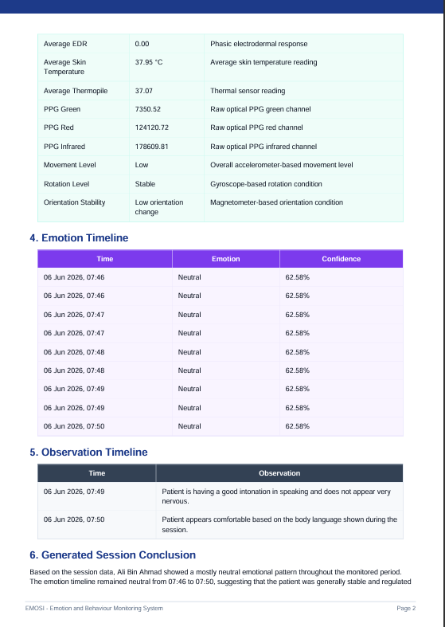
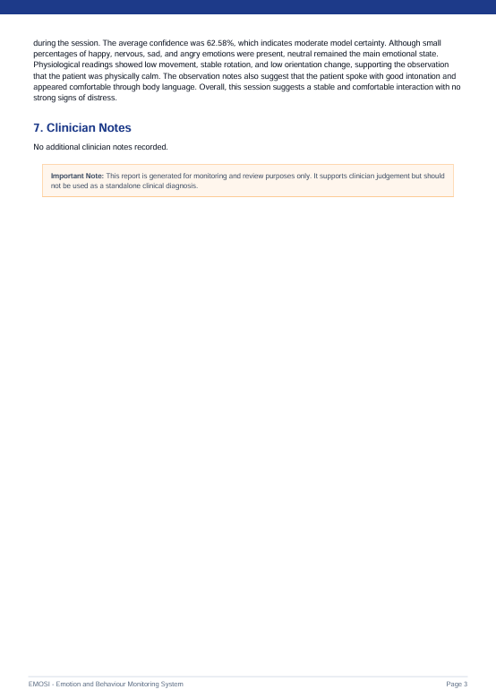

# Dashboard Development

## Overview

The EmoSI dashboard was developed using Streamlit to provide clinicians with an interactive web interface for monitoring emotional and physiological data collected from the EmotiBit wearable device.

The dashboard serves as the primary interaction layer between clinicians and the underlying AWS cloud infrastructure. It enables patient management, session monitoring, emotion prediction visualization, appointment scheduling, and automated report generation.

---

## Dashboard Objectives

The dashboard was designed to:

- Register and manage patients
- Schedule monitoring appointments
- Start and manage live monitoring sessions
- Visualize physiological signals in real time
- Display emotion prediction results
- Record clinician observations
- Store session information in DynamoDB
- Generate downloadable session summary reports

---

# User Authentication

## Login Page

The login page authenticates registered users before allowing access to the clinician portal.

Features:

- Email-based login
- Password authentication
- Role-based access control
- Secure session handling

---

## Account Registration

New clinicians can create an account through the registration page.

Features:

- Full name registration
- Email validation
- Password creation and confirmation
- User role assignment

---

# Dashboard Home

## Main Dashboard Overview

The dashboard home page provides clinicians with a high-level overview of system activity and patient monitoring information.

Displayed information includes:

- Active monitoring sessions
- Recent patient activities
- AWS connection status
- Navigation shortcuts

---

## Dashboard Statistics

Additional dashboard widgets summarize patient and session information.

Displayed metrics include:

- Total patients
- Total completed sessions
- Recent emotion predictions
- Monitoring activity summaries

---

## Physiological Monitoring Summary

The dashboard provides quick access to physiological monitoring information.

Features:

- Physiological signal overview
- Session statistics
- Recent monitoring activity

---

## Emotion Monitoring Summary

Emotion prediction results are summarized to support clinician decision-making.

Displayed information includes:

- Predicted emotional states
- Emotion probabilities
- Session outcomes

---

# Patient Management Module

The Patient Management module allows clinicians to register and maintain patient information.

## Patient Registration

New patients can be added through the registration form.

Information collected:

- Patient name
- Age
- Gender
- Guardian name
- Additional notes

---

## Patient Session Overview

Clinicians can review patient histories and previous monitoring sessions.

Displayed information includes:

- Total completed sessions
- Last session date
- Last detected emotion
- Current monitoring status

---

## Patient Summary Cards

Patient summary cards provide a simplified overview of individual patients.

Displayed information includes:

- Patient demographics
- Guardian information
- Session history
- Current status

---

# Session Management Module

The Session Management module is the core monitoring component of the system.

## Session Preparation

Before monitoring begins, clinicians can review patient information and previous session history.

Displayed information includes:

- Patient demographics
- Previous sessions
- Session readiness status
- Initial clinician notes

---

# Live Monitoring Dashboard

During an active monitoring session, physiological data are continuously retrieved from DynamoDB and visualized in real time.

## Heart Rate Monitoring

The dashboard displays heart rate trends derived from the EmotiBit PPG sensor.

Features:

- Real-time BPM updates
- Historical trend visualization
- Continuous monitoring

---

## Electrodermal Activity Monitoring

The dashboard visualizes:

- EDA (Electrodermal Activity)
- EDL (Electrodermal Level)
- EDR (Electrodermal Response)

These indicators are used to assess physiological arousal and emotional responses.

---

## Motion Monitoring

Motion data are calculated from:

- Accelerometer signals
- Gyroscope signals
- Magnetometer signals

The dashboard visualizes movement intensity and orientation changes during monitoring sessions.

---

## Emotion Prediction Summary

Emotion probabilities generated by the machine learning model are displayed in real time.

Displayed emotions include:

- Happy
- Neutral
- Nervous
- Sad
- Angry

The emotion with the highest probability is used as the dominant emotion prediction.

---

## Observation Notes

Clinicians can record observations during live monitoring.

Examples include:

- Behavioural responses
- Verbal communication
- Attention level
- Emotional reactions

These notes are stored together with the session record.

---

# Appointment Scheduling Module

The appointment scheduling module helps clinicians organize future monitoring sessions.

## Appointment Creation

Features:

- Patient selection
- Date selection
- Time scheduling
- Session planning

---

## Appointment Management

Clinicians can review upcoming appointments.

Displayed information includes:

- Appointment date
- Scheduled time
- Assigned patient
- Appointment status

---

# Historical Session Module

Historical monitoring sessions can be reviewed for longitudinal analysis.

## Session History Overview

The dashboard provides access to previously completed monitoring sessions.

---

## Historical Physiological Data

Clinicians can review:

- Heart rate trends
- EDA signals
- Temperature readings
- Motion information

---

## Historical Emotion Analysis

Displayed information includes:

- Dominant emotions
- Emotion probabilities
- Confidence scores

---

## Session Timeline

The session timeline summarizes emotional changes throughout the monitoring period.

---

## Observation Review

Clinician observations recorded during monitoring sessions can be reviewed.

---

## Session Summary Access

Users can access generated reports and review monitoring outcomes.

---

# Automated Session Report Generation

At the end of a monitoring session, the system automatically generates a PDF report.

## Session Report Page 1

Contents:

- Patient information
- Session information
- Dominant emotion
- Emotion summary

---

## Session Report Page 2

Contents:

- Physiological signal summary
- Emotion timeline
- Observation timeline

---

## Session Report Page 3

Contents:

- Generated conclusion
- Clinician notes
- Report disclaimer

---

# Dashboard Technologies

The dashboard was developed using:

- Streamlit
- Plotly
- Pandas
- NumPy
- Boto3
- AWS DynamoDB
- AWS Lambda
- SageMaker Inference Endpoint

---

# Summary

The EmoSI dashboard provides clinicians with a complete monitoring environment that integrates patient management, physiological signal visualization, machine learning-based emotion prediction, appointment scheduling, historical session review, and automated report generation within a single web platform.
